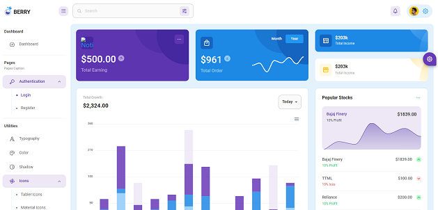

# berry-mui-react-admin

```
Berry Free React Material UI Admin Template
```

> Berry is a free Material UI admin dashboard template built with React. It is meant to provide the best possible User Experience with highly customizable feature-rich pages. It is a complete Dashboard Template that has easy and intuitive responsive design whether it is viewed on retina screens or laptops.



## Documentation

[Berry documentation](https://codedthemes.gitbook.io/berry/) helps you with installation, deployment, and troubleshooting.

## Technology Stack

-   [Material UI V5](https://material-ui.com/)
-   Built with React Hooks API
-   Redux & React Context API for State Management
-   React Router for Navigation Routing
-   Support of react-script
-   Code Splitting
-   CSS-in-JS where CSS is composed using JavaScript instead of defined in external files

---

&copy; 2021-2023 @bcryptorider920

All Rights Reserved.
